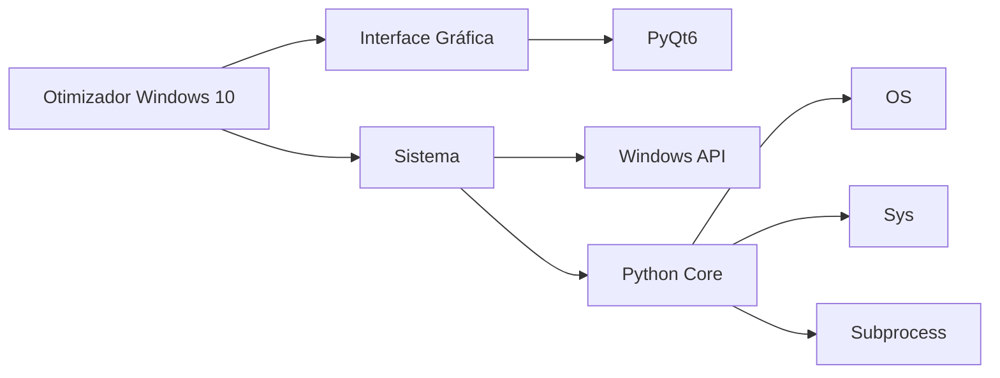

<h1 align="center">
  🚀 EasyOptimize
</h1>

   

## 📋 Sobre o Projeto

EasyOptimize é uma ferramenta desenvolvida em Python com interface gráfica PyQt6, projetada para melhorar o desempenho do seu sistema Windows 10. Com uma interface moderna e intuitiva, o aplicativo oferece diversas opções de otimização que podem ser selecionadas de acordo com as necessidades do usuário.

## ⚡ Download e Instalação Rápida

1. Acesse a [página de releases](https://github.com/samuelbr38/Otimizador-Windows-10/releases/tag/Download)
2. Baixe o arquivo executável `EasyOptimize.exe`
3. Execute o programa (não necessita instalação)

## ✨ Funcionalidades

- 🧹 **Limpeza de Arquivos Temporários**: Remove arquivos temporários do sistema para liberar espaço em disco
- ⚙️ **Otimização do Registro**: Ajusta configurações do registro para melhor desempenho
- 🔄 **Gestão de Serviços**: Desativa serviços desnecessários do sistema que consomem recursos
- 💾 **Limpeza de Cache**: Libera a memória cache do sistema para melhor performance
- ⚡ **Ajustes de Performance**: Aplica configurações avançadas para otimizar o desempenho geral

## 🛠️ Tecnologias Utilizadas

## 📱 Screenshots do Aplicativo

  
  

## 📈 Recursos do Projeto

- Interface gráfica moderna e intuitiva
- Seleção flexível de otimizações
- Barra de progresso em tempo real
- Sistema de avisos e confirmações
- Tratamento de erros robusto
- Executável standalone (não requer instalação)
- Compatível com Windows 10

## ⚠️ Requisitos do Sistema

- Sistema Operacional: Windows 10
- Mínimo de 50MB de espaço em disco
- Conexão com a internet não é necessária

## 👨‍💻 Autor

Feito com ❤️ por [Samuel S](https://github.com/samuelbr38)

---

  <a href="https://github.com/samuelbr38/Otimizador-Windows-10/releases/tag/Download">Download</a> •

